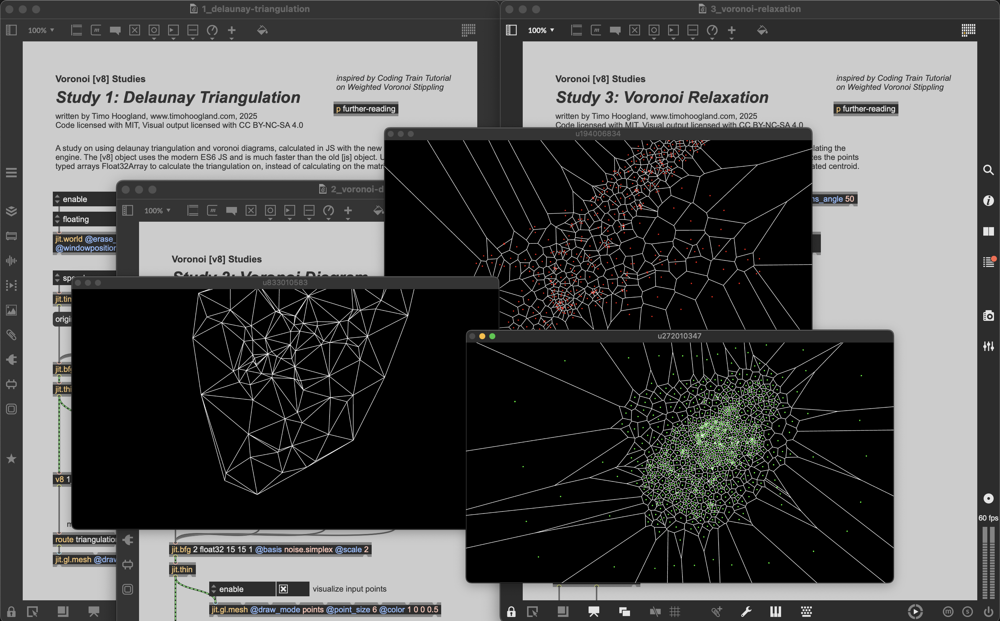
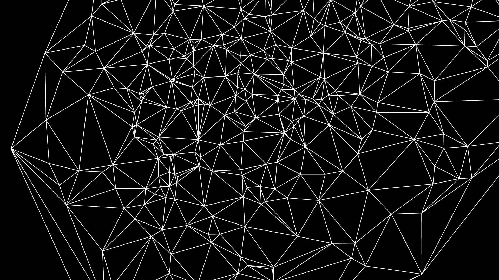
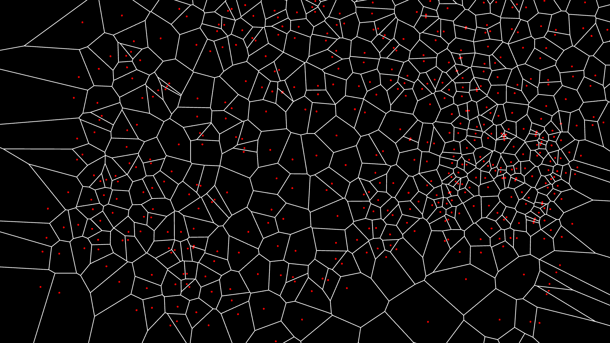
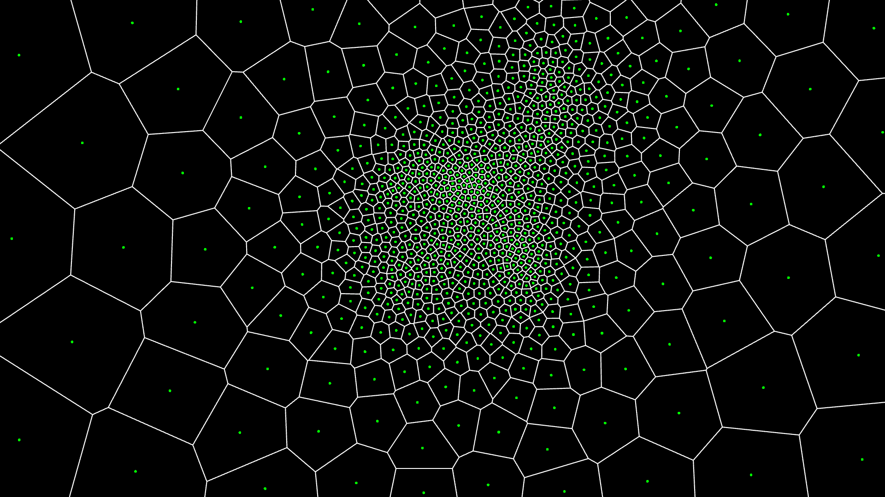

# 🕸 Voronoi Diagram & Delaunay Triangulation

#### 📟 [See more visuals and code!](http://gumroad.com/tmhglnd)

A study into Delaunay Triangulation and Voronoi Diagrams with MaxMSPJitter and v8js engine.

# 🔎 About

This repository contains 3 patches, all various studies on the subject of delaunay triangulation and voronoi diagrams. The Delaunay Triangulation subdivides a set of points into triangles, in such a way that the circumcircles of those triangles don't contain any other points. When connecting the centers of the circumcircles of the Delaunay triangles, you get the Voronoi Diagram. Next the voronoi diagram can be used as a starting point to apply Lloyd's Algorithm, also called Voronoi Relaxation. This will slowly give all the cells an even amount of space and "relax" the surface subdivision.

I was initially inspired by the Coding Train tutorial about Weighted Voronoi Stippling. Since I'm a Max user I was interested to see if this was doable to recreate in Jitter. I used the new `[v8]` javascript engine in Max9, which is many times faster than the previous `[js]` object. I also made use of the faster typed-arrays `Float32Array` to work with matrices within v8, instead of working directly on the matrix. For the calculations of the Triangulation and the Voronoi I use the [d3-delaunay](https://www.npmjs.com/package/d3-delaunay) node package, but it's not used within `[node.script]`, instead it is included in [v8] via `require()`. 

All the code is commented throughout for you to read and learn from. If you have any questions, thoughts, suggestions, bugs, feel free to submit an [issue](https://github.com/tmhglnd/voronoi-triangulation/issues) 

## Delaunay Triangulation

## Voronoi Diagram

## Relaxation

# 💻 Usage 

1. 🤓 Install [**Max 9**](https://cycling74.com/downloads)
2. 👾 Download or clone this repository
3. 🚀 Start Max9 and open the first study `1_delaunay-triangulation.maxpat`
4. 🪄 Click `enable` to start the `[jit.world]` rendering

# 📚 Resources

- [https://thecodingtrain.com/challenges/181-image-stippling](https://thecodingtrain.com/challenges/181-image-stippling)

- [https://en.wikipedia.org/wiki/Delaunay_triangulation](https://en.wikipedia.org/wiki/Delaunay_triangulation)

- [https://en.wikipedia.org/wiki/Voronoi_diagram](https://en.wikipedia.org/wiki/Voronoi_diagram)

- [https://en.wikipedia.org/wiki/Lloyd%27s_algorithm](https://en.wikipedia.org/wiki/Lloyd%27s_algorithm)

# 🙏 Thanks

Thanks to Daniël Shiffman from the Coding Train Tutorials for the initial idea and p5js implementation.

# 📋 License

The visual output and aesthetic of the patches is licenced under: CC BY-NC-SA 4.0 License

You are free to:

`Share` — copy and redistribute the material in any medium or format

`Adapt` — remix, transform, and build upon the material for any purpose, even commercially.

Under the following terms:

`Attribution` — You must give [appropriate credit](https://creativecommons.org/licenses/by-nc-sa/4.0/#ref-appropriate-credit), provide a link to the license, and [indicate if changes were made](https://creativecommons.org/licenses/by-nc-sa/4.0/#ref-indicate-changes). You may do so in any reasonable manner, but not in any way that suggests the licensor endorses you or your use.

`ShareAlike` — If you remix, transform, or build upon the material, you must distribute your contributions under the [same license](https://creativecommons.org/licenses/by-nc-sa/4.0/#ref-same-license) as the original.

`NonCommercial` - You may not use the material for [commercial purposes](https://creativecommons.org/licenses/by-nc-sa/4.0/#ref-commercial-purposes).

The code is licensed under: The [MIT License](https://mit-license.org/)

THE SOFTWARE IS PROVIDED "AS IS", WITHOUT WARRANTY OF ANY KIND, EXPRESS OR IMPLIED, INCLUDING BUT NOT LIMITED TO THE WARRANTIES OF MERCHANTABILITY, FITNESS FOR A PARTICULAR PURPOSE AND NONINFRINGEMENT. IN NO EVENT SHALL THE AUTHORS OR COPYRIGHT HOLDERS BE LIABLE FOR ANY CLAIM, DAMAGES OR OTHER LIABILITY, WHETHER IN AN ACTION OF CONTRACT, TORT OR OTHERWISE, ARISING FROM, OUT OF OR IN CONNECTION WITH THE SOFTWARE OR THE USE OR OTHER DEALINGS IN THE SOFTWARE.